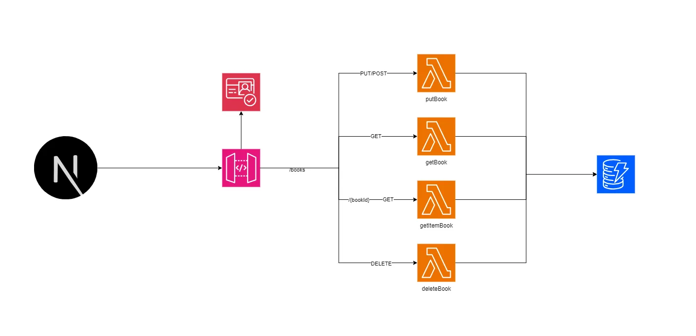

# books-api-crud-cdk

## AWS CDK Backend Stack

This project showcases the usage of the AWS Cloud Development Kit (CDK) to provision an AWS infrastructure stack for managing books. The stack includes resources such as an Amazon DynamoDB table for storing book information and AWS Lambda functions for handling CRUD (Create, Read, Update, Delete) operations on the books. 

## Frontend Demo

You can find a demo of the frontend application that uses this backend stack [here](https://main.d1v7b18a5j9npz.amplifyapp.com/).

Source code for the frontend application can be found [here](https://github.com/jer-nc/fullstack-book-crud-cdk-nextjs13/tree/main).

## AWS Resources Created

The AWS CDK stack created by this project includes the following AWS resources:

### DynamoDB Table

- **Name:** `booksTable`
- This table stores information about books, such as title, author...

### Lambda Functions

1. **`getBooksFunc`**: Retrieves a list of books (Scan) from the `booksTable`.
2. **`putBooksFunc`**: Adds a new book to the `booksTable`.
3. **`deleteBooksFunc`**: Deletes a book from the `booksTable`.
4. **`getItemBooksFunc`**: Retrieves a single book by its ID from the `booksTable`.

### API Gateway

- An API Gateway named `Books` is created with the following endpoints:
  - `/books`: For listing, creating, and deleting books.
  - `/books/{bookId}`: For retrieving individual books.

## Cognito User Pool & Authorizer

This project also includes user authentication using Amazon Cognito.

A user pool client is created to manage user access to the API. The API Gateway is configured to use this user pool as an authorizer, requiring users to sign in before they can access the API endpoints.

## Documentation

In each resource folder (e.g. `lib/api`), there is a `README.md` file that contains information about the resource. 

## References:

- [Youtube videos by Focus Otter](https://www.youtube.com/watch?v=4s1pNyEKlWs)
